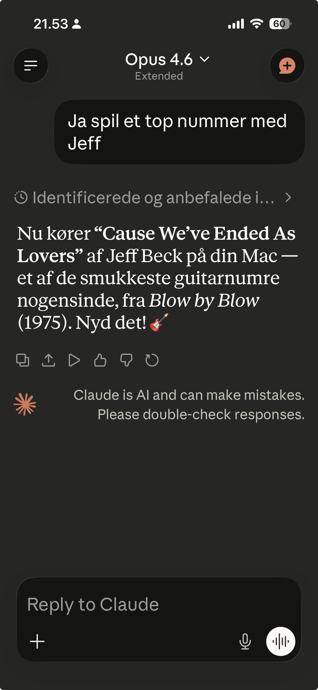

# 🎵 Apple Music MCP Server

A Model Context Protocol (MCP) server for Apple Music with remote playback control. Search the catalog, create playlists, manage your library, and control Music.app on your Mac — all from Claude on your iPhone.

**Live at:** `https://music.broberg.dk`




## Features

### 33 Tools

#### Catalog Tools (8 — no auth required)

| Tool | Description |
|------|-------------|
| `search_catalog` | Search songs, artists, albums in Apple Music catalog |
| `get_artist_songs` | Get all songs by an artist (full discography) |
| `get_artist_albums` | Get all albums by an artist |
| `get_charts` | Top songs/albums/playlists, optionally by genre |
| `get_genres` | List all available genres (for chart filtering) |
| `get_catalog_playlist` | Get a curated/editorial playlist with tracks |
| `get_song_details` | Full details for songs by ID (artwork, preview URL, release date) |
| `get_album_details` | Full album details with all tracks and editorial notes |

#### Library & Personal Tools (12 — Apple Music auth required)

| Tool | Description |
|------|-------------|
| `create_playlist` | Create a playlist with tracks in your library |
| `add_tracks_to_playlist` | Add tracks to an existing playlist |
| `list_playlists` | List your Apple Music playlists |
| `get_playlist_tracks` | Get all tracks in a library playlist |
| `add_to_library` | Add songs/albums/playlists to your library |
| `search_library` | Search your personal music library |
| `recently_played` | Your recent listening history (albums/playlists) |
| `recently_played_tracks` | Recently played tracks with full details (up to 50) |
| `heavy_rotation` | Your most frequently played content |
| `recommendations` | Personalized music recommendations |
| `replay` | Apple Music Replay — your top songs/artists/albums for the year |
| `auth_status` | Check auth status and home controller connection |

#### Quiz Tool (1)

| Tool | Description |
|------|-------------|
| `music_quiz` | Generate a music quiz with questions, song IDs, answers, and hints |

**Quiz types:** guess-the-artist, guess-the-song, guess-the-album, guess-the-year, intro-quiz, mixed

**Sources:** your recently played, heavy rotation, library, charts, or a specific artist's catalog

**Filters:** by decade (e.g. "1980" for 80s), genre, or artist

Claude orchestrates the game — plays each song, asks the question, gives hints if you're stuck, keeps score, and announces the winner. Take your Mac to a party, connect to a speaker via AirPlay, and run a quiz from your phone.

#### Playback & AirPlay Tools (12 — home controller required)

| Tool | Description |
|------|-------------|
| `now_playing` | What's currently playing on the Mac |
| `play` | Start playback, optionally a specific track by name |
| `pause` | Pause playback |
| `next_track` | Skip to next track |
| `previous_track` | Go back to previous track |
| `set_volume` | Set or get Music.app volume (0–100) |
| `search_and_play` | Search library and play first match |
| `play_playlist_on_mac` | Play a playlist by name |
| `shuffle` | Enable/disable shuffle |
| `airplay_devices` | List AirPlay devices (Apple TVs, HomePods, etc.) |
| `set_airplay` | Enable/disable an AirPlay device |
| `set_airplay_volume` | Set volume for a specific AirPlay device |

### Transport & Auth

| Transport | Endpoint | Auth | Clients |
|-----------|----------|------|---------|
| Streamable HTTP | `/mcp` | OAuth 2.1 (PKCE + DCR) | claude.ai (web + iOS) |
| SSE (legacy) | `/sse` | None | Claude Desktop, Claude Code |

OAuth 2.1 uses JWT tokens that survive server restarts. Dynamic Client Registration allows claude.ai to self-register.

## Architecture


**Key design:** The home controller connects *outbound* to the MCP server via WebSocket ("phone home" pattern). No tunnel, no port forwarding, no DNS — works behind any firewall/NAT. Same architecture as [code-launcher](https://github.com/cbroberg/code-launcher).

## Quick Start

### 1. Apple Developer Setup

You need an [Apple Developer account](https://developer.apple.com/account) ($99/year).

1. Go to **Certificates, Identifiers & Profiles**
2. Under **Identifiers**, click **+** → choose **Media IDs**
3. Register a new Media ID (e.g., `media.music.dk.broberg`)
4. Enable **MusicKit**, **ShazamKit**, and **Apple Music Feed**
5. Under **Keys**, click **+** → create a new key
6. Enable **MusicKit** and select your Media ID
7. Download the `.p8` private key file
8. Note your **Key ID** and **Team ID**

### 2. Local Development

```bash
git clone https://github.com/cbroberg/apple-music-mcp.git
cd apple-music-mcp
npm install
cp env.example .env
```

Edit `.env` with your credentials. For the private key, convert the `.p8` file to a single line:

```bash
awk 'NF {sub(/\r/, ""); printf "%s\\n",$0;}' AuthKey_XXXXXX.p8
```

Build and run:

```bash
npm run build
npm start
```

Visit `http://localhost:3000/auth` to authorize your Apple Music account.

### 3. Deploy to Fly.io

```bash
fly apps create apple-music-mcp
fly certs add your-domain.example.com

# Set secrets
fly secrets set APPLE_TEAM_ID=xxx APPLE_KEY_ID=xxx
fly secrets set APPLE_PRIVATE_KEY="$(awk 'NF {sub(/\r/, ""); printf "%s\\n",$0;}' AuthKey_XXXXXX.p8)"
fly secrets set SERVER_URL=https://your-domain.example.com
fly secrets set JWT_SECRET=$(openssl rand -hex 32)
fly secrets set HOME_API_KEY=$(openssl rand -hex 32)

fly deploy
```

### 4. Connect to claude.ai

1. Go to **Settings** → **Integrations** → **Add integration**
2. Enter URL: `https://your-domain.example.com/mcp`
3. Claude.ai handles the OAuth 2.1 flow automatically
4. Available on web, iPhone, and Android

### 5. Connect to Claude Desktop / Claude Code

Add to your MCP config:

```json
{
  "mcpServers": {
    "apple-music": {
      "url": "https://your-domain.example.com/sse"
    }
  }
}
```

### 6. Authorize Apple Music

Visit `https://your-domain.example.com/auth` and sign in with your Apple Music account. This grants the server permission to create playlists and access personalized features.

> **Note:** The Music User Token is stored in memory. The server runs with `min_machines_running = 1` to preserve it, but it will be lost on deploys. Re-visit `/auth` after deploying.

### 7. Home Controller (optional — for playback)

The home controller runs on a Mac and lets Claude control Music.app remotely. It connects *outbound* via WebSocket — no tunnel, no port forwarding, works on any network (home, office, hotspot).

#### Quick test

```bash
cd apple-music-mcp
HOME_API_KEY=<same key as Fly secret> ./home/start.sh
```

#### Auto-start with launchd (recommended)

Build the agent once:

```bash
cd apple-music-mcp && npx tsc -p home/tsconfig.json
```

Create `~/Library/LaunchAgents/dk.broberg.apple-music-home.plist`:

```xml
<?xml version="1.0" encoding="UTF-8"?>
<!DOCTYPE plist PUBLIC "-//Apple//DTD PLIST 1.0//EN" "http://www.apple.com/DTDs/PropertyList-1.0.dtd">
<plist version="1.0">
<dict>
    <key>Label</key>
    <string>dk.broberg.apple-music-home</string>
    <key>ProgramArguments</key>
    <array>
        <string>/path/to/node</string>
        <string>/path/to/apple-music-mcp/home/dist/server.js</string>
    </array>
    <key>EnvironmentVariables</key>
    <dict>
        <key>HOME_API_KEY</key>
        <string>your-home-api-key</string>
        <key>MCP_WS_URL</key>
        <string>wss://your-domain.example.com/home-ws</string>
    </dict>
    <key>RunAtLoad</key>
    <true/>
    <key>KeepAlive</key>
    <true/>
    <key>StandardOutPath</key>
    <string>/tmp/apple-music-home.log</string>
    <key>StandardErrorPath</key>
    <string>/tmp/apple-music-home.log</string>
</dict>
</plist>
```

> **Tip:** Find your node path with `readlink -f "$(which node)"` — especially if you use fnm/nvm.

Load it:

```bash
launchctl load ~/Library/LaunchAgents/dk.broberg.apple-music-home.plist
```

The agent now starts at login and restarts automatically if it crashes. Check status with `launchctl list | grep broberg` and logs with `tail -f /tmp/apple-music-home.log`.

## Usage Examples

From Claude (iPhone or desktop):

> "What's playing on my Mac right now?"

> "Play some Jeff Beck"

> "Set the volume to 40"

> "Show my AirPlay devices and play on Stue Apple TV"

> "What are my top songs according to Apple Music Replay?"

> "Create a playlist called 'Sunday Jazz' with my recently played tracks"

> "What are the top 10 songs in Denmark right now?"

> "Search for Mew and show me their full discography"

> "Next track" / "Pause" / "Shuffle on"

> "Start a music quiz! 5 questions, intro-quiz, based on my recently played"

> "80s rock quiz — 10 questions, play on Stue Apple TV"

> "Make a quiz about The Police from their full catalog"

## License

MIT — Christian Broberg / WebHouse ApS
